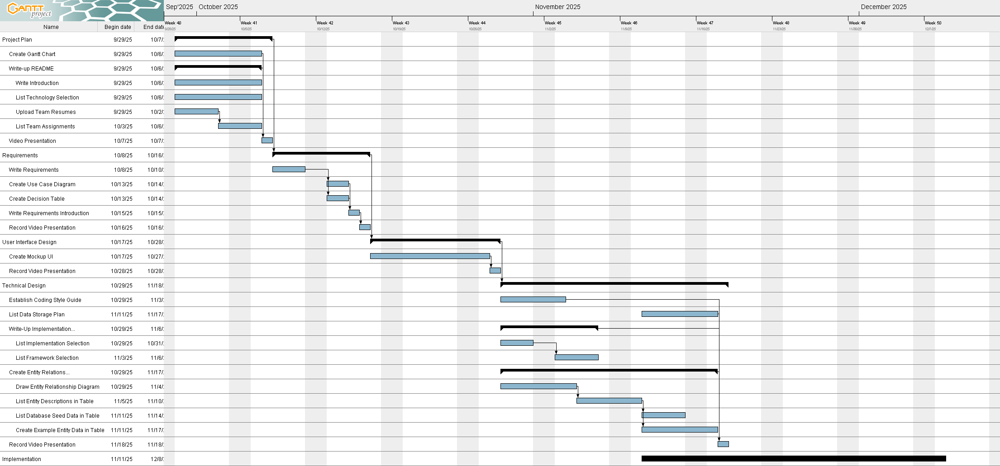

# Introduction

# Meet our team
- [William Rose](./project-plan/resumes/william_rose.md)
- [Sawyer Strickland](./project-plan/resumes/sawyer_strickland.md)
- [Luke Wharton](./project-plan/resumes/luke_wharton.md)
- [Joshua De Vicente-Reyes] (./project-plan/resumes/joshua_de_vicente.md)
- Hayden Ross (No Resume)

# Team Assignments

# Technology Selection
- For our application, we will be coding in Python and using Flask as our webserver. We will use a SQLite database to store all of our data.
- See [here](./project-plan/technology-selection/README.md) for a full explanation of what we are using and why.

# Project Plan
See a link to our Gantt chart [here](./project-plan/gantt-chart/ganttproject.gan)

