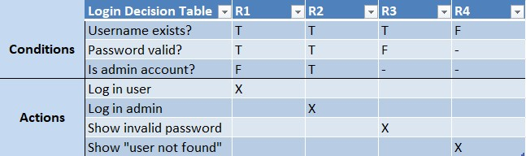
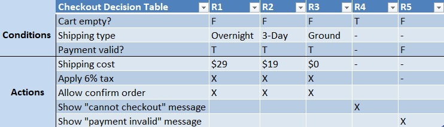
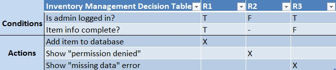
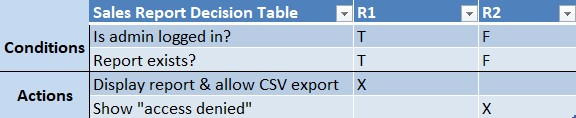

# Decision Table

This page documents the decision rules for Version 1 of our Missile E-Commerce Site.  
Each table is shown as an image (visible inline) followed by a short written rules summary.

---

## 1) Login Decision Table

*Figure 1. Login Decision Table*

**Rules Summary**
- **R1:** Username exists AND password valid AND not admin → Log in user.
- **R2:** Username exists AND password valid AND is admin → Log in admin.
- **R3:** Username exists AND password invalid → Show “invalid password”.
- **R4:** Username does not exist → Show “user not found”.

---

## 2) Checkout Decision Table (Shipping, Tax, Validation)

*Figure 2. Checkout Decision table*

**Rules Summary**
- **R1:** Cart not empty, payment valid, shipping = Overnight → Shipping $29, apply 6% tax, allow Confirm Order.
- **R2:** Cart not empty, payment valid, shipping = 3-Day → Shipping $19, apply 6% tax, allow Confirm Order.
- **R3:** Cart not empty, payment valid, shipping = Ground → Shipping $0, apply 6% tax, allow Confirm Order.
- **R4:** Cart empty → Block checkout and show “cannot checkout” message.
- **R5:** Payment invalid → Show “payment invalid” message and block confirm.

---

## 3) Inventory Management Decision Table (Admin)

*Figure 3. Inventory Management Decision table*

**Rules Summary**
- **R1:** Admin logged in AND item info complete → Add item to database.
- **R2:** Not admin → Show “permission denied”.
- **R3:** Admin logged in BUT item info incomplete → Show “missing data” error.

---

## 4) Sales Report Decision Table (Admin)

*Figure 4. Sales Report Decision Table*

**Rules Summary**
- **R1:** Admin logged in AND report exists → Display report and allow CSV export.
- **R2:** Not admin → Show “access denied”.

---

## Notes
- All monetary calculations are base-10 decimals; tax = **6%** of subtotal.
- Shipping choices: **Overnight $29**, **3-Day $19**, **Ground $0**.
- Screenshots are stored in `/requirements/` and linked with **relative paths** so they display inline on GitHub.
