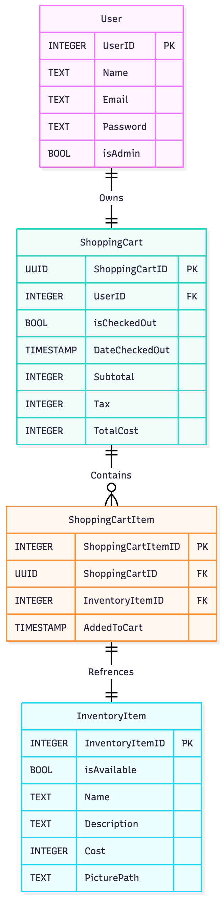

# Technical Design

## Table of Contents
- [A. Implementation Language(s)](#a)
- [B. Implementation Framework(s)](#b)
- [C. Data Storage Plan](#c)
- [D. Entity Relationship Diagram](#d)
- [E. Entity/Field Descriptions](#e)
- [F. Data Examples](#f)
- [G. Database Seed Data](#g)
- [H. Authentication and Authorization Plan](#h)
- [I. Coding Style Guide](#i)
- [Technical Design Presentation](#j)

## A. Implementation Language(s)
For our languages we have chosen to develop our project in:
- Python3.12:
    - All team members have more experience with Python than Java or C#
    - Simple syntax significantly increase development and prototyping speed
    - Significant amount of quailty of life packages for building web applications
- HTML5:
    - All browsers natively understand and know how to render HTML
    - Simple syntax, easy to pick up for members of our group that haven't used it before
- CSS:
    - We will be using CSS vicariously through DaisyUI
- Javascript:
    - Allows website to have interactive buttons and dynamic content
    - Supported in all major web browsers

## B. Implementation Framework(s)
For our implementation frameworks and libraires we have chosen:
- (framework) Flask:
    - Really popular and easy to follow web application framework for Python
    - Comes with out of the box SQLite support, which is our database of choice
    - Amazing Documentation
- (TailwindCSS Component Library) DaisyUI:
    - Pure CSS prebuilt components, works on any browser
    - Has a rich component library and detailed documentation
    - Supports all TailwindCSS modifiers as well
- (ORM) SQL_Alchemy:
    - Converts SQL tables and queries into pythonic class objects in our code base
    - Makes working with SQLite intuitive and easy to use for team members without SQL experience

## C. Data Storage Plan
We plan to use SQLite for data storage. Since Flask offers native support for connecting and 
persisting SQLite databases, this was the natural choice. TODO: Got stuck here

## D. Entity Relationship Diagram

## E. Entity/Field Descriptions
### User Table
| Property | Type                | Default | Nullable | Relationship | Notes |
|:----------:|:----------------------:|:---------:|:----------:|:--------------:|-------:|
| user_id   | Integer, Primary Key |         | No       |              | SQLite autoincrements this, should never enter this manually |
| name     | Text                |         | No       |              |       |
| password | Text                |         | No       |              | This is hashed and then stored in database |
| email    | Text                |         | No       |              |       |
| is_admin  | Boolean             | FALSE   | No       |              |       |
### ShoppingCart Table
| Property        | Type               | Default | Nullable | Relationship       | Notes |
|:----------:|:----------------------:|:---------:|:----------:|:--------------:|-------:|
| shopping_cart_id    | UUID (Text), Primary Key  |         | No       |                    | UUID as shopping carts are unique; once purchased, isBought flips to yes, null data is filled, and the user receives a new UUID |
| user_id           | Integer, Forigen Key |         | No       | Relates to user.user_id | Used to tell whose shopping cart this item is in |
| is_checked_out     | Boolean            | FALSE   | No       |                    | Used to track carts; not deleted—checked-out carts remain for records |
| date_checked_out   | Text               | NULL    | Yes      |                    | Timestamp string "YYYY-MM-DDTHH:MM:SSZ" |
| sub_total         | Integer            | NULL    | Yes      |                    |       |
| tax              | Integer            | NULL    | Yes      |                    |       |
| total_cost        | Integer            | NULL    | Yes      |                    | Stored as integer cents (divide by 100 for display) |
### ShoppingCartItem Table
| Property           | Type                 | Default | Nullable | Relationship     | Notes |
|:----------:|:----------------------:|:---------:|:----------:|:--------------:|-------:|
| shopping_cart_item_id  | Integer, Primary Key |         | No       |                                |       |
| shopping_cart_id      | UUID, Forigen Key    |         | No       | Relates to ShoppingCart.shopping_cart_id |       |
| inventory_item_id     | Integer, Forigen Key |         | No       | Relates to InventoryItem.inventory_item_id |       |
| added_to_cart         | Text                 | Now     | No       |                                | Timestamp "YYYY-MM-DDTHH:MM:SSZ" |
### InventoryItem Table
| Property        | Type                 | Default | Nullable | Relationship | Notes |
|:----------:|:----------------------:|:---------:|:----------:|:--------------:|-------:|
| inventory_item_id   | Integer, Primary Key |         | No       |              |       |
| is_available       | Boolean             | TRUE    | No       |              | Marked false when bought; hidden from store |
| name              | Text                |         | No       |              |       |
| description       | Text                |         | No       |              |       |
| cost              | Integer             |         | No       |              | Stored as integer cents (divide by 100 for display) |
| picture_path       | Text                | ~/static/images/no_picture_added.png | No | | Path to stored image; default is placeholder |

## F. Data Examples

## G. Database Seed Data

## H. Authentication and Authorization Plan

## I. Coding Style Guide

## Technical Design Presentation
See [here]() for a link to the technical design video presentation.
