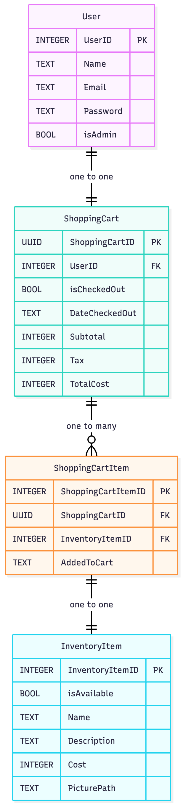

# Technical Design

## Table of Contents
- [A. Implementation Language(s)](#a)
- [B. Implementation Framework(s)](#b)
- [C. Data Storage Plan](#c)
- [D. Entity Relationship Diagram](#d)
- [E. Entity/Field Descriptions](#e)
- [F. Data Examples](#f)
- [G. Database Seed Data](#g)
- [H. Authentication and Authorization Plan](#h)
- [I. Coding Style Guide](#i)
- [Technical Design Presentation](#j)

<a id="a"></a>
## A. Implementation Language(s)
For our languages we have chosen to develop our project in:
- Python 3.12
    1. All team members have more experience with Python than Java or C#.
    2. Simple syntax significantly increases development and prototyping speed.
    3. Significant amount of quality of life packages for building web applications.
- HTML5
    1. All browsers natively understand and know how to render HTML.
    2. Simple syntax, easy to pick up for members of our group that haven't used it before.
- CSS
    1. We will be using CSS vicariously through DaisyUI.
- JavaScript
    1. Allows website to have interactive buttons and dynamic content.
    2. Supported in all major web browsers.

<a id="b"></a>
## B. Implementation Framework(s)
For our implementation frameworks and libraries we have chosen:
- Framework - Flask
    1. Really popular and easy to follow web application framework for Python.
    2. Comes with out of the box SQLite support, which is our database of choice.
    3. Amazing documentation.
- TailwindCSS Component Library - DaisyUI
    1. Pure CSS prebuilt components, works on any browser.
    2. Has a rich component library and detailed documentation.
    3. Supports all TailwindCSS modifiers as well.
- ORM - SQLAlchemy
    1. Converts SQL tables and queries into pythonic class objects in our codebase.
    2. Makes working with SQLite intuitive and easy to use for team members without SQL experience.

<a id="c"></a>
## C. Data Storage Plan
We plan to use SQLite for data storage. Since Flask offers native support for connecting and 
persisting SQLite databases, this was the natural choice. On apps first run it will create an 
instance folder where our database is stored, Flask also offers a CLI command `init_db` that
is used to seed the database.

<a id="d"></a>
## D. Entity Relationship Diagram


<a id="e"></a>
## E. Entity/Field Descriptions
### User Table
| Property | Type                | Default | Nullable | Relationship | Notes |
|:----------:|:----------------------:|:---------:|:----------:|:--------------:|:-------:|
| id   | Integer, Primary Key |         | No       |              | SQLite autoincrements this, should never enter this manually |
| name     | Text                |         | No       |              |       |
| password | Text                |         | No       |              | This is hashed and then stored in database |
| email    | Text                |         | No       |              |       |
| is_admin  | Boolean             | FALSE   | No       |              |       |
### ShoppingCart Table
| Property        | Type               | Default | Nullable | Relationship       | Notes |
|:----------:|:----------------------:|:---------:|:----------:|:--------------:|:-------:|
| id    | UUID (Text), Primary Key  |         | No       |                    | UUID as shopping carts are unique; once purchased, isBought flips to yes, null data is filled, and the user receives a new UUID |
| user_id           | Integer, Forigen Key |         | No       | Relates to user.id | Used to tell whose shopping cart this item is in |
| is_checked_out     | Boolean            | FALSE   | No       |                    | Used to track carts; not deleted—checked-out carts remain for records |
| date_checked_out   | Text               | NULL    | Yes      |                    | Timestamp string "YYYY-MM-DDTHH:MM:SSZ" |
| sub_total         | Integer            | NULL    | Yes      |                    |       |
| tax              | Integer            | NULL    | Yes      |                    |       |
| total_cost        | Integer            | NULL    | Yes      |                    | Stored as integer cents (divide by 100 for display) |
### ShoppingCartItem Table
| Property           | Type                 | Default | Nullable | Relationship     | Notes |
|:----------:|:----------------------:|:---------:|:----------:|:--------------:|:-------:|
| id  | Integer, Primary Key |         | No       |                                |       |
| shopping_cart_id      | UUID (Text), Forigen Key    |         | No       | Relates to ShoppingCart.id |       |
| inventory_item_id     | Integer, Forigen Key |         | No       | Relates to InventoryItem.id |       |
| added_to_cart         | Text                 | Now     | No       |                                | Timestamp "YYYY-MM-DDTHH:MM:SSZ" |
### InventoryItem Table
| Property        | Type                 | Default | Nullable | Relationship | Notes |
|:----------:|:----------------------:|:---------:|:----------:|:--------------:|:-------:|
| id   | Integer, Primary Key |         | No       |              |       |
| is_available       | Boolean             | TRUE    | No       |              | Marked false when bought; hidden from store |
| name              | Text                |         | No       |              |       |
| description       | Text                |         | No       |              |       |
| cost              | Integer             |         | No       |              | Stored as integer cents (divide by 100 for display) |
| picture_path       | Text                | ~/static/images/no_picture_added.png | No | | Path to stored image; default is placeholder |


<a id="f"></a>
## F. Data Examples
### User Table
| id | name    | password (Hashed, sha256)  | email | is_admin |
| :------: | :--------: | :-------------------: | :------------------------: | :-------: |
| 1      | Luke Wharton            | 36e230203d860d1d34654e0c3ece4b3b9a26c22aec43648256adf57dbbdbaede | lukesemail@example.com   | T       |
| 2      | Joshua De Vicente-Reyes | cfaab62e3a4ca4d12a86e8bf35ec0124c95cefad6384d7f8bacbd5b7aab72dbc | joshsemail@example.com  | F       |
| 3      | Sawyer Strickland       | 482dc677bb11de8108cae43b672ce3893073f2c1e823dd3b091823beee7630ca | sawyeremail@example.com | F       |
| 4      | Will Rose               | f39ac12b4654233c1987ba2773efc5b7511bd39dbaba8e1a9e260d48713280ff | willemail@example.com     | F       |

### ShoppingCart Table
| id               | user_id | is_checked_out | date_checked_out | sub_total (cents) | tax (cents)   | total_cost (cents) |
| :--------------------------: | :------: | :------------: | :--------------: | :----------------: | :-------------: | :-----------------: |
| 5c21e55c-6c1d-43c0-82dd-7b0b290d3349 | 1      | FALSE        | NULL           | NULL             | NULL          | NULL              |
| 2cd1fabb-cf91-49c4-b637-2f5313fbafe4 | 2      | FALSE        | NULL           | NULL             | NULL          | NULL              |
| e3ca6ae3-2f10-4dcd-8859-90b7fb5b18d2 | 3      | FALSE        | NULL           | NULL             | NULL          | NULL              |
| d8695c78-d85f-4a6a-8dae-98aec278aaad | 4      | TRUE         | 11/9/2025      | 27,000,000,000   | 1,620,000,000 | 28,620,000,000    |
| 8bb161fc-1264-4168-98a0-d5ee406f29a8 | 4      | FALSE        | NULL           | NULL             | NULL          | NULL              |

### ShoppingCartItem Table
| id | shopping_cart_id                       | inventory_item_id | added_to_cart |
| :------------------: | :------------------------------------: | :---------------: | :-----------: |
| 1                  | d8695c78-d85f-4a6a-8dae-98aec278aaad | 1               | 11/1/2025   |
| 2                  | 2cd1fabb-cf91-49c4-b637-2f5313fbafe4 | 4               | 8/10/2025   |
| 3                  | 8bb161fc-1264-4168-98a0-d5ee406f29a8 | 2               | 9/30/2025   |
| 4                  | e3ca6ae3-2f10-4dcd-8859-90b7fb5b18d2 | 3               | 11/2/2025   |


### InventoryItem Table
| ID | is_available | name             | description | cost (cents)   | picture_path                           |
| :---------------: | :-----------: | :----------------: | :-----------: | :--------------: | :-------------------------------------: |
| 1               | FALSE       | F16 Viper        | A lightweight, highly maneuverable multirole fighter designed for air superiority and precision strike missions. Known for its agility, advanced avionics, and reliable operational performance across diverse combat environments.           | 27,000,000,000 | ~~/static/images/f16_viper.png        |
| 2               | TRUE        | F22 Raptor       | A fifth-generation stealth air superiority fighter featuring unmatched maneuverability, advanced sensor fusion, and supercruise capability. Designed to dominate contested airspace with precision and survivability.           | 35,000,000,000 | ~~/static/images/f22_raptor.png       |
| 3               | TRUE        | F35 Lightning II | A cutting-edge multirole stealth aircraft built for strike, intelligence, and electronic warfare missions. Integrates next-generation sensors, networked data sharing, and short-takeoff capabilities depending on variant.           | 8,250,000,000  | ~~/static/images/no_picture_added.png |
| 4               | TRUE        | C17 Globemaster  | A strategic transport aircraft built to carry large payloads across intercontinental distances. Capable of rapid deployments, airdrops, and operations on short or unprepared runways.           | 900,000,000    | ~~/static/images/c17_globemaster.png  |

<a id="g"></a>
## G. Database Seed Data
### User Table
| id | name    | password (Hashed, sha256)  | email | is_admin |
| :------: | :--------: | :-------------------: | :------------------------: | :-------: |
| 1      | Ron Swanson           | 36e230203d860d1d34654e0c3ece4b3b9a26c22aec43648256adf57dbbdbaede | ronsemail@example.com   | T       |

### InventoryItem Table
| id | is_available | name             | description | cost (cents)   | picture_path                           |
| :---------------: | :-----------: | :----------------: | :-----------: | :--------------: | :-------------------------------------: |
| 1               | TRUE        | F16 Viper        | A lightweight, highly maneuverable multirole fighter designed for air superiority and precision strike missions. Known for its agility, advanced avionics, and reliable operational performance across diverse combat environments.           | 27,000,000,000 | ~~/static/images/f16_viper.png        |
| 2               | TRUE        | F22 Raptor       | A fifth-generation stealth air superiority fighter featuring unmatched maneuverability, advanced sensor fusion, and supercruise capability. Designed to dominate contested airspace with precision and survivability.           | 35,000,000,000 | ~~/static/images/f22_raptor.png       |
| 3               | TRUE        | F35 Lightning II | A cutting-edge multirole stealth aircraft built for strike, intelligence, and electronic warfare missions. Integrates next-generation sensors, networked data sharing, and short-takeoff capabilities depending on variant.           | 8,250,000,000  | ~~/static/images/no_picture_added.png |
| 4               | TRUE        | C17 Globemaster  | A strategic transport aircraft built to carry large payloads across intercontinental distances. Capable of rapid deployments, airdrops, and operations on short or unprepared runways.           | 900,000,000    | ~~/static/images/c17_globemaster.png  |
| 5               | TRUE        | F15 Strike Eagle | A twin-engine, long-range, all-weather fighter that delivers exceptional speed and payload capacity. Optimized for deep-strike missions while maintaining strong air-to-air capability.           | 870,000,000    | ~~/static/images/f15_strike_eagle.png |
| 6               | FALSE       | ATACMS           | A long-range, precision-guided surface-to-surface missile capable of neutralizing high-value targets at extended distances. Known for its speed, accuracy, and destructive payload.           | 100,000,000    | ~~/static/images/atacms.png           |
| 7               | FALSE       | PrSM             | A next-generation long-range strike missile offering extended reach and advanced guidance. Designed to provide precision engagement against strategic ground targets with improved lethality and flexibility.           | 1,100,000,000  | ~~/static/images/no_picture_added.png |
| 8               | FALSE       | UH-60 Black Hawk       | A versatile, highly durable utility helicopter used for troop transport, medevac, and cargo missions. Recognized for its reliability, maneuverability, and performance in demanding environments.          | 1,000,000,000  | ~~/static/images/no_picture_added.png |

#Logistics Table
| id | overnight_shipping (cents) | 3_day_shipping (cents) | ground_shipping | tax (%) |
| :-: | :--: | :---: | :--: | :--: |
| 1   | 2900 | 1900  | 0    | 7    |


<a id="h"></a>
## H. Authentication and Authorization Plan

### H.1 Overview and Responsibilities

Our system separates:

- **Authentication** – verifying *who* is logging in.
- **Authorization** – checking *what* that authenticated user is allowed to do.
We use a single login screen for all users. The user’s role (regular user vs administrator) is determined **after** login by checking the `is_admin` field in the `User` table.

### H.2 User Model and Role Storage
We represent users and their roles with a single SQLAlchemy model:

```python
class User(db.Model):
    __tablename__ = "user"

    user_id = db.Column(db.Integer, primary_key=True)
    name = db.Column(db.String, nullable=False)
    email = db.Column(db.String, unique=True, nullable=False)
    password_hash = db.Column(db.String, nullable=False)
    is_admin = db.Column(db.Boolean, nullable=False, default=False)
```
- `password_hash` stores a hashed password (PBKDF2 via Werkzeug).
- `is_admin` is `True` for Administrator and `False` for regular users.

### H.3 Authentication Design (Identify Who Is Logging In)
Authentication is handled in a dedicated login route. The steps are:
1. Read credentials from the login form (`email`, `password`).
2. Look up the `user` row by `email`
3. Verify the sumbitted password with `User.password_hash`
4. If valid, store the user's identity and role in session.

## H.4 Authorization Design (Control What Actions a User Can Perform)
Once authenticated, authorization is enforced at two levels:
1. Route-Level authorization (role-based)
2. Data-Level authorization (ownership checks on entities, such as carts)

- Regular users will be redirected or receive 403 Forbidden when trying to hit admin-only endpoints.
- Even if a route is accessible to all authenticated users, we still need to restrict access to specific database rows. Example: a user should only see their own shopping cart unless they are an admin.

### H.5 Session Managment
We will use Flask’s built-in session management, which stores session data in a secure, signed cookie.
- On successful authentication, we establish a session and persist key user information:
    - `session["user_id"] = user.user_id`
    - `session["is_admin"] = user.is_admin`
- Protected routes will:
    - Use `@login_required` to verify that `session["user_id"]` exists before granting access.
    - Redirect to the login page if the user is not authenticated.
- Session Termination:
    - When the user logs out, `session.clear()` is called to remove all stored credentials and invalidate the current session. 

Error messages are kept generic (“Invalid email or password”) to avoid leaking whether a given email exists.
Will come back later to recheck.

<a id="i"></a>
## I. Coding Style Guide
- All code in the project will follow the [PEP 8](https://peps.python.org/pep-0008/) style guide because:
    1. It is the style that all of our team defaults to when writing Python code.
    2. It is the official style guide for Python.

- All code written should have high cohesion and low coupling.

- All code written should be readable and use proper commenting so it can be understood by other developers. "Proper commenting" in this case means concisely explaining complex or non-obvious logic, possibly including reasoning behind it. 

- All commits to the project repository during development will follow the [GitFlow](https://www.atlassian.com/git/tutorials/comparing-workflows/gitflow-workflow) branch management strategy because:
    1. The implementation of pull requests encourage code reviews. This practice will help us maintain a clean and cohesive codebase, along with ensuring that it meets the standards of the style guide.
    2. The use of branching helps protect the stability of the *main* branch by isolating the work of each developer.


<a id="j"></a>
## Technical Design Presentation
See [here]() for a link to the technical design video presentation.
